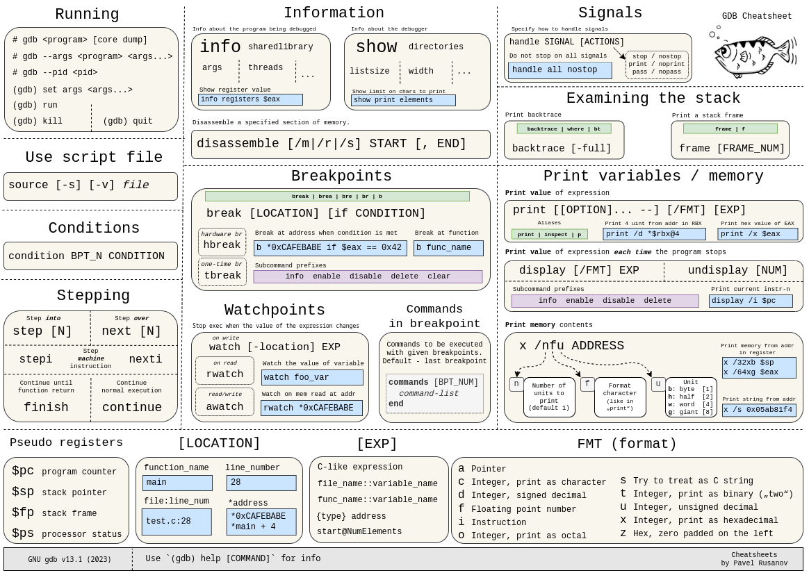

# GDB Cheatsheet

[GDB](https://www.sourceware.org/gdb/), the GNU Project debugger, allows you to see what is going on 'inside' another program while it executes -- or what another program was doing at the moment it crashed.

It looks like this:

