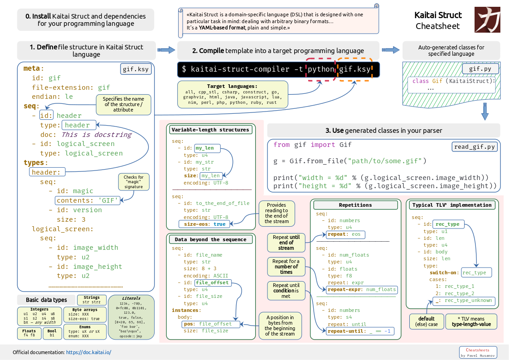

# Kaitai Struct Cheatsheet

[Kaitai Struct](https://kaitai.io) is a declarative language used to describe various binary data structures, laid out in files or in memory.

The main idea is that a particular format is described in Kaitai Struct language (`.ksy` file) and then can be compiled with `ksc` into source files in one of the supported programming languages. 

This cheatsheet helps writing your own templates using Kaitai Struct.

It looks like this:

